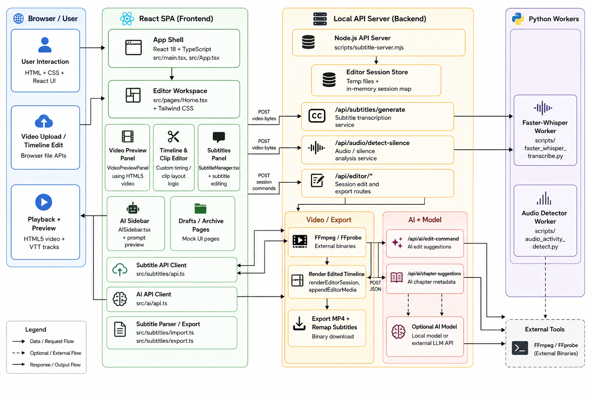

# VidVersityVideoEditor

## **Overview**

This document describes the current local architecture for the `VidVersityVideoEditor` project, with detailed technical stacks for:

- Frontend UI and video preview
- Subtitle generation and subtitle import/export
- Silence detection
- AI-assisted editing and chapter suggestion
- Backend editing/session services
- Video export and timeline processing

## **Technology Stack**

- Languages:
    - Frontend: TypeScript + React
    - Backend: JavaScript / Node.js (ESM)
    - Workers: Python 3 (local virtual environment)
    - UI: HTML + CSS + Tailwind CSS
- Frontend runtime:
    - `react` 18.3.1
    - `react-dom` 18.3.1
    - `react-router` 7.5.3
    - `react-hook-form` 7.56.1
    - `zustand` 5.0.5
    - `i18next` 25.1.2, `react-i18next` 15.5.1
    - `recharts` 2.15.3
    - `lucide-react` 0.503.0
    - `cmdk` 1.1.1, `motion` 12.17.0
- UI and styling:
    - `tailwindcss` 3.4.17
    - `tailwindcss-animate` 1.0.7
    - `postcss` 8.5.3
    - `autoprefixer` 10.4.21
    - `esbuild-style-plugin` 1.6.3
    - `clsx` 2.1.1, `class-variance-authority` 0.7.1, `tailwind-merge` 3.2.0
- Bundler / dev server:
    - `esbuild` 0.25.4
- Backend runtime:
    - Node.js native `http` server in `scripts/subtitle-server.mjs`
    - Uses built-in modules: `http`, `fs/promises`, `child_process`, `os`, `path`, `crypto`
    - No Express, Koa, or other external server framework
- Python worker stack:
    - Python 3.x (project uses virtualenv `.venv`, Windows `py -3`, macOS/Linux `python3`)
    - `faster-whisper==1.0.3`
    - `requests` (unpinned version)
- Media tooling:
    - FFmpeg and FFprobe system binaries
    - Environment variables: `VIDVERSITY_FFMPEG_BIN`, `VIDVERSITY_FFPROBE_BIN`, `FASTER_WHISPER_PYTHON`
- AI support:
    - Backend route proxy to local/external chat model
    - Uses JSON prompt payloads and expects JSON-only AI responses

## **Libraries and Package Versions**

### **Frontend dependencies (`package.json`)**

- @hookform/resolvers ^5.0.1
- @radix-ui/react-accordion ^1.2.8
- @radix-ui/react-alert-dialog ^1.1.11
- @radix-ui/react-aspect-ratio ^1.1.4
- @radix-ui/react-avatar ^1.1.7
- @radix-ui/react-checkbox ^1.2.3
- @radix-ui/react-collapsible ^1.1.8
- @radix-ui/react-context-menu ^2.2.12
- @radix-ui/react-dialog ^1.1.11
- @radix-ui/react-dropdown-menu ^2.1.12
- @radix-ui/react-hover-card ^1.1.11
- @radix-ui/react-label ^2.1.4
- @radix-ui/react-menubar ^1.1.12
- @radix-ui/react-navigation-menu ^1.2.10
- @radix-ui/react-popover ^1.1.11
- @radix-ui/react-progress ^1.1.4
- @radix-ui/react-radio-group ^1.3.4
- @radix-ui/react-scroll-area ^1.2.6
- @radix-ui/react-select ^2.2.2
- @radix-ui/react-separator ^1.1.4
- @radix-ui/react-slider ^1.3.2
- @radix-ui/react-slot ^1.2.0
- @radix-ui/react-switch ^1.2.2
- @radix-ui/react-tabs ^1.1.9
- @radix-ui/react-toast ^1.2.11
- @radix-ui/react-toggle ^1.1.6
- @radix-ui/react-toggle-group ^1.1.7
- @radix-ui/react-tooltip ^1.2.4
- class-variance-authority ^0.7.1
- clsx ^2.1.1
- cmdk ^1.1.1
- date-fns ^3.6.0
- embla-carousel-react ^8.6.0
- i18next ^25.1.2
- input-otp ^1.4.2
- lucide-react ^0.503.0
- motion ^12.17.0
- next-themes ^0.4.6
- react ^18.3.1
- react-day-picker ^8.10.1
- react-dom ^18.3.1
- react-hook-form ^7.56.1
- react-i18next ^15.5.1
- react-resizable-panels ^2.1.9
- react-router ^7.5.3
- recharts ^2.15.3
- sonner ^2.0.3
- tailwind-merge ^3.2.0
- vaul ^1.1.2
- zod ^3.24.3
- zustand ^5.0.5

### **Frontend devDependencies (`package.json`)**

- @types/react ^19.1.3
- @types/react-dom ^19.1.3
- autoprefixer ^10.4.21
- esbuild 0.25.4
- esbuild-style-plugin ^1.6.3
- postcss ^8.5.3
- rimraf ^6.0.1
- tailwindcss ^3.4.17
- tailwindcss-animate ^1.0.7

### **Python dependencies (`requirements-faster-whisper.txt`)**

- faster-whisper==1.0.3
- requests

## **Detailed Architecture Diagram**

the overall draft 

detail of the whole project

### **API routes and interfaces**

### **Subtitle transcription**

- `POST /api/subtitles/generate`
    - Request: raw video/audio binary body
    - Query params: `model`, `language`, `task` (optional)
    - Backend: `scripts/subtitle-server.mjs` calls `scripts/faster_whisper_transcribe.py`
    - Response: JSON subtitle model with `segments`, `language`, `duration`
    - Example response shape:
        - `segments: [{id, start, end, text, tokens?}]`

### **Audio / silence detection**

- `POST /api/audio/detect-silence`
    - Request: raw video/audio binary body
    - Query params: `noiseThresholdDb`, `minSilenceDuration`, `minSegmentDuration`
    - Backend: `scripts/subtitle-server.mjs` spawns `scripts/audio_activity_detect.py`
    - Response: JSON with `audioDuration`, `silence_segments`, `speech_segments`

### **Editor session and timeline editing**

- `POST /api/editor/session`
    - Create or update an editor session
    - Request body: JSON with `sessionId`, `sourceFile`, `timeline`, `subtitles`, `metadata`
    - Response: JSON `sessionId`, `status`, `workspacePath`
- `POST /api/editor/append` and `POST /api/editor/append-audio`
    - Add new media or subtitle tracks to a session
    - Request body: JSON with `sessionId`, `mediaUrl`, `subtitleData`, `appendOptions`
    - Response: JSON with updated `session` state and export candidate info
- `POST /api/editor/export`
    - Exports combined video + subtitles to MP4 or other target
    - Request body: JSON with `sessionId`, `exportFormat`, `subtitleFormat`, `renderOptions`
    - Backend uses FFmpeg / FFprobe to generate `Content-Disposition` download file
    - Response: binary media stream or download URL
- `POST /api/editor/source-download`
    - Downloads or proxies the source video asset from remote URL
    - Request body: JSON with `sourceUrl`, optional `assetHeaders`
    - Response: binary source stream or local temp file path

### **AI editing and chapter metadata**

- `POST /api/ai/edit-command`
    - Request: JSON with `prompt`, `currentSubtitles`, `editorState`, `model`
    - Response: JSON with `suggestedEdits`, `markdown`, `reasoning`
    - Backend may call external AI model endpoint or local AI service
- `POST /api/ai/chapter-suggestions`
    - Request: JSON with `subtitles`, `transcript`, `duration`
    - Response: JSON chapter markers and titles

### **Interface patterns and data flow**

- Frontend API wrappers in `src/subtitles/api.ts` and `src/ai/api.ts`
    - `generateSubtitles` sends video/audio blobs and receives segments JSON
    - `detectAudioSilence` sends same blob and receives silence/speech ranges
    - `exportEditorSession` triggers backend render/export and downloads asset
    - `editCommand` and `chapterSuggestions` forward AI prompts
- Backend file store patterns:
    - Temporary session files in node temp folder `TMPDIR/vidversity-faster-whisper`
    - `EDITOR_SESSION_DIR` stores session source, normalized media, rendered exports, and subtitle intermediates
    - `sessionId` maps to in-memory state and file locations via `editorSessions` map
    - Temporary exports and intermediate clips are created via FFmpeg subprocesses and deleted after use

### **Video storage methods**

- Persistent local storage is handled by backend temp files and browser downloads
    - Source video is uploaded to backend and written as a temporary session file
    - Backend writes normalized media and rendered exports under `EDITOR_SESSION_DIR`
    - Exports are sent back as `Content-Disposition` binary downloads from `/api/editor/export`
    - Source/downloaded remote videos may be proxied via `/api/editor/source-download` and cached to local temp storage
- In-browser storage and playback
    - Video playback uses browser object URLs from `File` blobs or downloaded media
    - Edited timeline state is managed in-memory in the frontend and persisted through session metadata, not through browser localStorage
- External storage options
    - The current app does not include a cloud storage backend, but the backend export route can be extended to write files to S3, Azure Blob, or other object storage
    - Recommended integration points: save rendered exports after `renderEditorSession`, or store original source under `EDITOR_SESSION_DIR` before editing

### **Python worker details**

- `scripts/faster_whisper_transcribe.py`
    - Loads `faster-whisper` model and transcribes audio payload
    - Outputs JSON subtitle segments for Node backend
- `scripts/audio_activity_detect.py`
    - Uses FFmpeg command line to detect silence with thresholds
    - Returns JSON silence/speech intervals for editor timeline

### **Deployment / local run notes**

- Frontend startup: `npm run dev` or `npm run build`
- Backend / worker: Node API server + Python worker invoked per request
- FFmpeg binaries must be installed and available via `PATH` or explicit env vars
- Python worker environment:
    - Create venv: `py -3 -m venv .venv` or `python3 -m venv .venv`
    - Activate and install: `pip install -r requirements-faster-whisper.txt`
- Recommended Python runtime: Python 3.10+ for `faster-whisper` compatibility

## **Frontend Details**

### **Core UI**

- `src/main.tsx`: renders `<App />` into `#app`
- `src/App.tsx`: sets up hash routing for `/`, `/drafts`, `/archive`
- `src/pages/Home.tsx`: main editor workspace and the largest single source of video editing logic
- `src/components/editor/AISidebar.tsx`: AI suggestion panel with preview and quick actions
- `src/components/subtitles/SubtitleManager.tsx`: subtitle status, editing, and timeline linkages
- `src/components/library/VideoLibraryPage.tsx`: draft/archive browsing and video upload UI

### **Frontend tech stack**

- React 18 + TypeScript
- esbuild dev server (`npm run dev`)
- Tailwind CSS for styling
- shadcn / Radix UI for form, dialog, select, and other reusable UI controls
- local browser `URL.createObjectURL(file)` video source handling

### **Video Preview & Timeline**

- `VideoPreviewPanel` uses native HTML5 `<video>` for playback
- Subtitles are rendered as a browser `track` element with generated VTT from `buildVttFromSubtitles`
- Playback control includes play/pause, frame step, seek, and edited/original mode
- Timeline features:
    - custom clip layout and segment mapping
    - edited vs original time conversion
    - timeline zoom, drag scrub, and thumbnail preview
    - clip selection, split, merge, cut, and append actions
- Thumbnails are generated by seeking a hidden video element and capturing frames via Canvas

### **Subtitle frontend flow**

- `src/subtitles/api.ts` exposes:
    - `generateSubtitlesFromVideo`
    - `detectSilenceFromVideo`
    - `createEditorSessionFromVideo`
    - editor session CRUD (replace, split, merge, cut, delete silence, export)
    - `appendVideoToEditorSession`
    - `downloadEditorSessionSourceFile`
- `src/subtitles/import.ts` parses external SRT/VTT files in-browser
- `src/subtitles/export.ts` builds SRT/VTT strings and remaps subtitle timestamps to edited timelines

### **AI frontend flow**

- `src/ai/api.ts` posts JSON prompts to backend AI endpoints
- `src/ai/types.ts` defines AI intents, operations, transcript segments, and suggestion payloads
- `src/ai/executionAdapter.ts` contains adapter logic for converting AI output into editor actions
- AI suggestions are surfaced in UI via `AISidebar` and can preview suggested cuts / chapter ideas

## **Backend / API Details**

### **Node backend**

- `scripts/subtitle-server.mjs` is a Node.js ESM HTTP server
- `npm run subtitles:server` starts the local API on `127.0.0.1:8787`
- Uses native APIs: `http`, `fs/promises`, `child_process`, `os`, `path`, `crypto`
- Persists active editor session media to temporary files under OS temp dir + `editor-sessions`
- Handles CORS and binary upload/download responses

### **API routes**

- `GET /api/health`
- `GET /` (route index + endpoint hints)
- `POST /api/subtitles/generate` → Faster-Whisper transcription
- `POST /api/audio/detect-silence` → FFmpeg-based silence detection on raw upload
- `POST /api/editor/session` → create timeline editing session from uploaded video
- `POST /api/editor/session/replace` → update clip metadata in session
- `POST /api/editor/session/category` → update category metadata
- `POST /api/editor/append` → append a new video to an existing session using FFmpeg concat
- `POST /api/editor/split` → split an existing clip in the session
- `POST /api/editor/merge` → merge adjacent clips in the session
- `POST /api/editor/cut` → cut a range of the edited timeline
- `POST /api/editor/detect-silence` → analyze current session timeline for silence
- `POST /api/editor/delete-silence` → remove selected silence ranges from session state
- `POST /api/editor/export` → render edited timeline into MP4 and stream binary download
- `GET /api/editor/source` → download current session source media
- `POST /api/ai/edit-command`
- `POST /api/ai/chapter-suggestions`

### **Editor session model**

- Each session stores:
    - `id`, `filePath`, `fileName`, `duration`
    - `segments[]` with `id`, `label`, `start`, `end`, optional `sourceRanges`
    - `nextSegmentId` and `selectedSegmentId`
    - category metadata for workspace organization

## **Subtitle Processing Detail**

- `scripts/faster_whisper_transcribe.py`:
    - loads `WhisperModel` from `faster_whisper`
    - supports model, language, device, compute type, and VAD filter flags
    - returns JSON transcript segments `{ id, start, end, text }`
- Frontend passes raw uploaded video bytes to `/api/subtitles/generate`
- Backend writes upload to temp file, invokes Python worker, returns parsed JSON
- Subtitles are normalized on frontend into `SubtitleSegment[]`
- Export path remaps subtitles to edited timeline and builds SRT/VTT text

## **Silence Detection Detail**

- `scripts/audio_activity_detect.py`:
    - normalizes audio with FFmpeg to mono 16kHz WAV
    - uses `ffmpeg -af silencedetect=noise=X:d=Y` to extract silence ranges
    - parses `silence_start` / `silence_end` output
    - computes speech ranges from silence gaps
- Backend can analyze:
    - raw video upload directly (`/api/audio/detect-silence`)
    - current edited session timeline after rendering clips to temp file (`/api/editor/detect-silence`)
- Frontend displays silence and speech segments for review in the right panel

## **AI Editing Detail**

- backend AI routes send a prompt containing:
    - user prompt
    - video duration
    - transcript segments
- AI server expects JSON-only responses and returns a normalized suggestion object
- `edit-command` returns action recommendations such as `cut`, `split`, `merge`, `mute`, `subtitle`, `trim_silence`
- `chapter-suggestions` returns review-only chapter markers and summaries
- Frontend currently supports previewing AI suggestions and encourages manual review before applying

## **Video Export and Rendering**

- Backend uses FFmpeg to:
    - inspect media duration and stream metadata with `ffprobe`
    - concatenate clips and render edited timeline with `concat` filter
    - optionally embed or export subtitles alongside video
    - generate session source / export files in temp storage
- Export from frontend is triggered by `exportEditorSessionVideo()` and streamed as binary MP4

## **Environment and Local Dev**

- `npm install` to install frontend dependencies
- `python -m venv .venv` and `pip install -r requirements-faster-whisper.txt`
- Frontend: `npm run dev`
- Backend: `npm run subtitles:server`
- Environment variables:
    - `FASTER_WHISPER_PYTHON`
    - `VIDVERSITY_FFMPEG_BIN`
    - `VIDVERSITY_FFPROBE_BIN`
    - `AI_MATCH_LOCAL`, `AI_DEBUG` for AI route behavior

## **Current Limitations**

- Subtitle generation is backend-driven and requires the local Python environment
- Silence removal is review/staged in session state; it is not a destructive timeline edit automatically
- AI suggestions are review-only and not applied without user confirmation
- Draft/archive pages are mock UI pages and do not yet connect to persistent saved projects